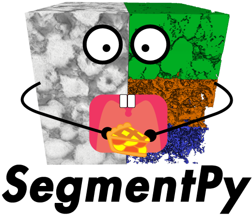

=====================================
Welcome to SegmentPy's homepage!
=====================================
SegmentPy (Pronunciation: Segment Pie) is a open-source graphical interface which facilitates training machine learning models for CT-image segmentation.
This package includes also analytic tools.

.. toctree::
   :maxdepth: 3
   :caption: Quick-start

   installation
   tutorial

.. toctree::
   :maxdepth: 3
   :caption: Models

   model

.. toctree::
   :maxdepth: 3
   :caption: Options & Analyse

   plug-ins
   developpers
   credits

Links
=====================================
* :doc:`Installation <./installation>`
* :doc:`Quick Tutorial <./tutorial>`
* :doc:`Plug-ins <./plug-ins>`
* :doc:`For Developpers <./developpers>`
* :doc:`Credits & Contributors <./credits>`

Indices and tables
=====================================
:ref:`genindex`
:ref:`modindex`
:ref:`search`