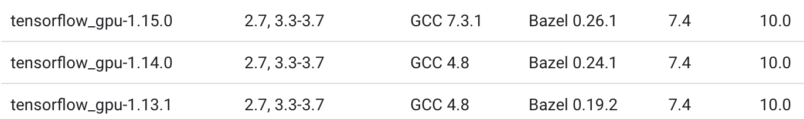
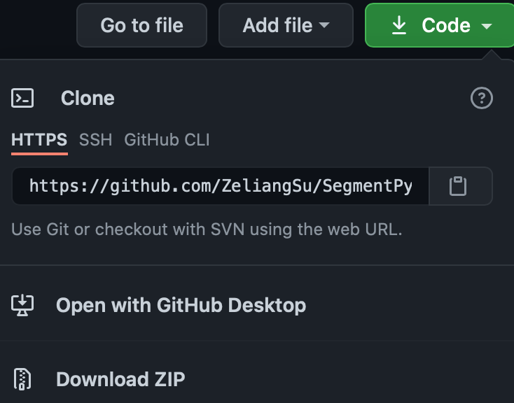

=====================================
Installation & Setup
=====================================
We highly recommand to use GPUs for the training. Cuda and MPI should be pre-installed in the device.

.. .. toctree::
..    :maxdepth: 3
..    :caption: Installation & Setup

..    Pre-requirements
..    Linux or MacOS
..    Windows
..    Frequent installation question

Pre-requirements
---------------------
1. nvidia gpu driver
2. cudatoolkit 10.0 (for the current implemented tensorflow version)

3. openmpi 

Linux or MacOS
---------------------
Installation by command 
.. Note::
   The interface is an alpha version, we invite you for now to install from source. 
   See below for installation from source.

Then in terminal type::

   $ pip install SegmentPy
or::

   $ conda install -c lrcs SegmentPy

After the installation, you should be able to open from Terminal by typing::

   $ segmentpy

Installation from source (nightly version):

1. go to https://github.com/ZeliangSu/SegmentPy 

and download by typing::

   $ git clone https://github.com/ZeliangSu/SegmentPy.git
   $ cd to/the/path/of/the/git/cloned/SegmentPy
   $ python setup.py install
2. or download the zip file and zip it, then::

   $ cd to/the/path/of/the/unzipped/SegmentPy
   $ python setup.py install

Launch the SegmentPy by typing in the Terminal::

   $ segmentpy

Windows 
---------------------
SegmentPy can be used on Windows, if the MS-MPI (MPI for microsoft) is properly installed.

Frequent installation questions
---------------------------------