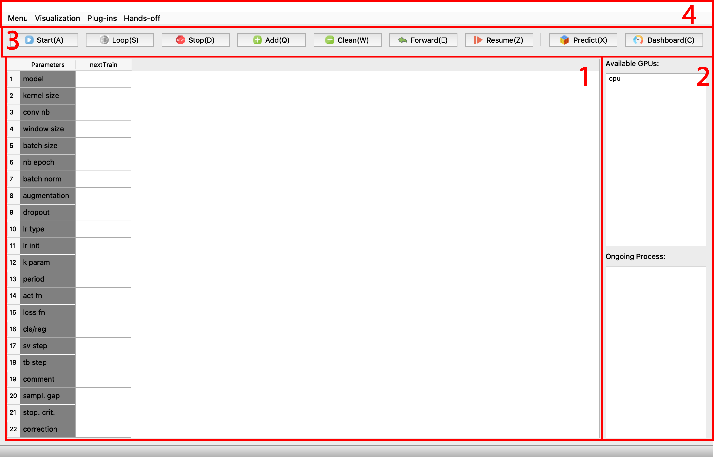
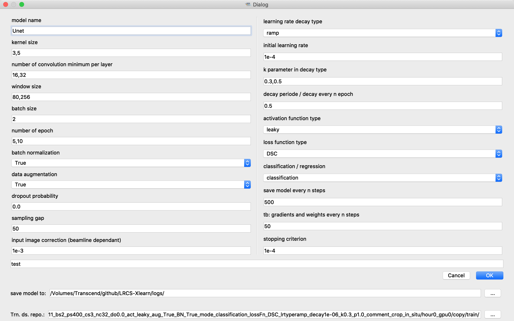
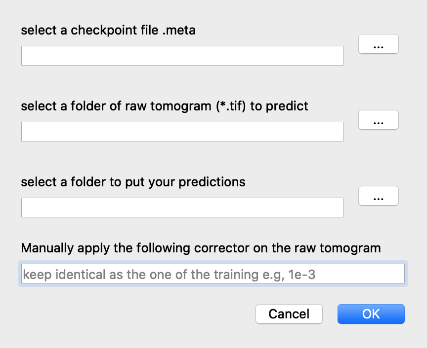
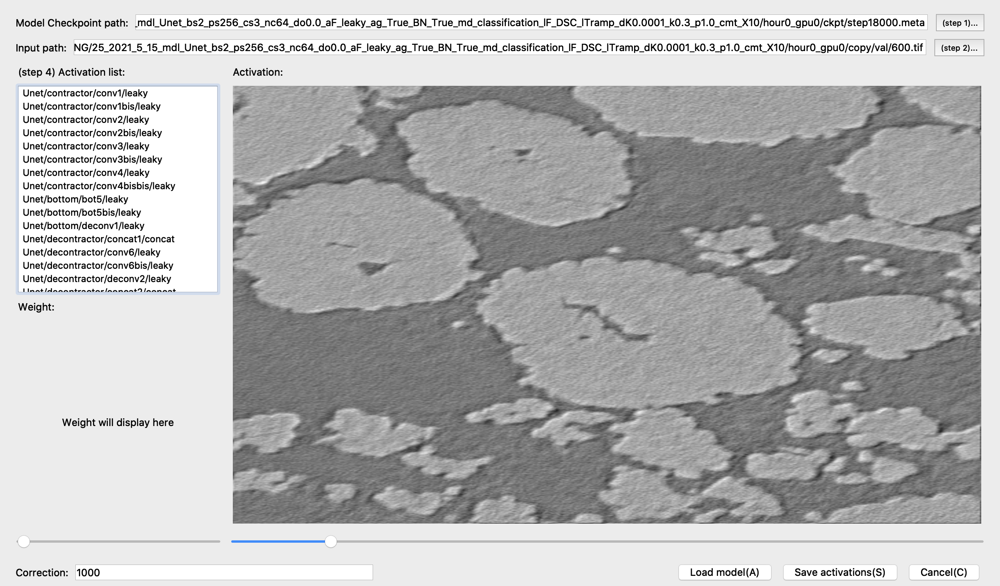

=====================================
Quick Tutorial
=====================================
Let's jump right into it. 
The training process is as simple as 

*Step 1*. prepare 2D raw tomography/labeled image pairs.

*Step 2*. entering hyperparameters.

*Step 3*. launch the training.

*Step 4*. pick the best training and make 3D prediction.

The main interface introduction
-------------------------------

Part 1. Table of training task waiting list.

Part 2. Lists of available gpu detected on your workstation and a ongoing training.

Part 3. Buttons for manipulating the task table, resuming/reusing trained models, making prediction, and watching the training scores.

Part 4. Menu bar for plug-ins and other analysis tools

Step 1: Well Preparing several labeled images to compose your datasets
----------------------------------------------------------------------
Do your best to make good ground truths, because the neural network will also learn the bad segmentation you give it. Adding the suffix '_label.tif' to the name of labeled image, e.g., '100.tif' of raw tomogram and '100_label.tif' for the labeled image. SegmentPy will automatically pair up the raw tomogram and your given labeled image.

.. image:: img/datasets.png
   :width: 512pt
   :align: center

Step 2: entering hyperparameters
--------------------------------

For adding tasks, one can click on button 'Add' or shortcut button Q on the keyboard. The following dialog for entering hyperparameters will pop up.

.. note::
   One can enter several parameters in a blanket and separate them by comma, e.g., '3,5,7' for the convolution kernel

One should prepare raw tomography image/labeled image pairs. Indicate the folders where you store the training/validation/testing datasets at the bottom of the dialog.

.. note::
   The current version (v0.1a) only supports .tif grey images.

Step 3: Launch the training
---------------------------
Click on the start bottom or the loop bottom to start the trainings.

Step 4: Pick the best training and make 3D prediction
-----------------------------------------------------

.. image:: img/dashboard.png
   :width: 512pt
   :align: center

Monitor(on live)/save/compare learning curves in Dashboard (above figure). Or using the 'extract results' dialog for comparing scores from trained model (load the folder you stock your trainings and hit 'extract' button, pick up the color for different hyperparameters).

For predicting, click on the 'predict' button at the main interface. In the poped-up dialog, indicate the path of the saved model, the folder of all the .tif raw tomograms, and where you want to put your predictions.

Optional: Track activations of each layer
-----------------------------------------

You can also monitor outputs of each neural layer using the 'ActViewer' in the 'Visualization' menu.

